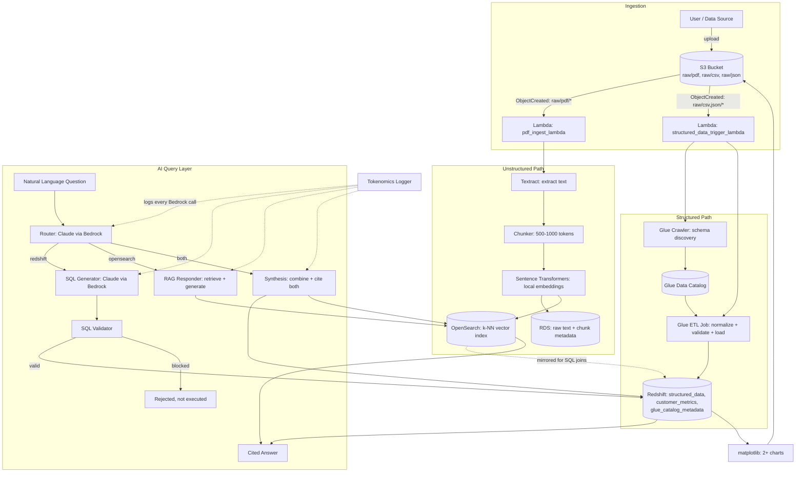

# Architecture

## Data Flow Diagram



## Service-by-Service

| Service | Role in this pipeline |
|---|---|
| **S3** | Central repository for all raw PDF/CSV/JSON uploads; also stores generated chart images. Prefixes: `raw/pdf/`, `raw/csv/`, `raw/json/`, `processed/`, `charts/`. |
| **Lambda** (`pdf_ingest_lambda.py`) | Triggered on PDF upload. Calls Textract, chunks text, generates embeddings locally via Sentence Transformers, writes to RDS + OpenSearch. |
| **Lambda** (`structured_data_trigger_lambda.py`) | Triggered on CSV/JSON upload. Starts the Glue Crawler and Glue ETL job. |
| **Textract** | Extracts text from PDF documents. |
| **Sentence Transformers** | Generates document embeddings **locally**, replacing Bedrock's embedding models (both `amazon.titan-embed-text-v2:0` and `cohere.embed-english-v3` are denied in this sandbox — a structural embeddings-capability gap, confirmed by direct testing). |
| **RDS (Postgres)** | Stores raw extracted text and chunk metadata for structured querying and traceability back to S3. |
| **OpenSearch** | Stores embedding vectors in a k-NN index for semantic document search. |
| **Glue Crawler** | Discovers and catalogs schemas for all ingested CSV/JSON files. |
| **Glue ETL Job** | Normalizes column names/types, validates required-field presence (logged to `glue_catalog_metadata`), and loads structured data into Redshift. |
| **Redshift** | Unified warehouse: structured business data (`structured_data`, `customer_metrics`), mirrored vector embeddings (`document_embeddings`), and Glue Catalog metadata validation results (`glue_catalog_metadata`) — all SQL-queryable together. |
| **Bedrock (Claude)** | Powers the entire AI query layer: routing/classification, NL-to-SQL generation, and grounded/cited response generation. **Always invoked via the inference-profile ARN**, never the bare model ID (see implementation note below). |
| **matplotlib** | Generates 2+ BI charts from Redshift data, saved as PNGs and uploaded to S3. |
| **IAM** | Three least-privilege roles: `CapstoneLambdaIngestionRole`, `CapstoneGlueRole`, `CapstoneRedshiftCopyRole` — each scoped to only what its component needs. |

## Key Implementation Notes

1. **Embeddings: Sentence Transformers, not Bedrock.** Both Bedrock embedding
   model families (`amazon.titan-embed-text-v2:0`, `cohere.embed-english-v3`) were
   tested directly against this sandbox account and both are denied. This is a
   structural gap in the account's Bedrock permissions (the embeddings capability
   itself), not something fixable by choosing a different embedding model. Sentence
   Transformers (`all-MiniLM-L6-v2`) runs entirely locally, needs no API key, and
   produces 384-dimensional vectors compatible with OpenSearch's k-NN index. Claude
   (text generation) via Bedrock is confirmed working and is used throughout the AI
   query layer.

2. **Bedrock calls require the inference-profile ARN.** Newer Claude models on
   Bedrock — including `claude-sonnet-4-6` — return a `ValidationException` when
   invoked with the bare model ID (`anthropic.claude-sonnet-4-6-v1:0`). Every call
   in this project goes through `ai_query_layer/bedrock_client.py`, which builds
   the correct ARN once (`config.BEDROCK_MODEL_ARN`):
   ```
   arn:aws:bedrock:<region>:<account_id>:inference-profile/us.anthropic.claude-sonnet-4-6
   ```

3. **SQL validation is mandatory and non-bypassable.** `redshift_executor.py`
   only ever executes SQL after `sql_validator.validate_sql()` has passed it —
   there is no direct-execution code path elsewhere in the project. The validator
   blocks any non-`SELECT` statement, any of `DROP/DELETE/UPDATE/INSERT/ALTER/
   TRUNCATE/GRANT/REVOKE`, and any stacked (semicolon-separated) statement.

4. **Synthesis queries produce one combined, cited answer.** For the two harder
   queries this year, `router.py` classifies the question as `"both"`, and
   `synthesis.py` runs the Redshift SQL path and the OpenSearch RAG path in the
   same function, then asks Claude to write a single unified answer explicitly
   comparing the two sources — rather than concatenating two separate answers.
